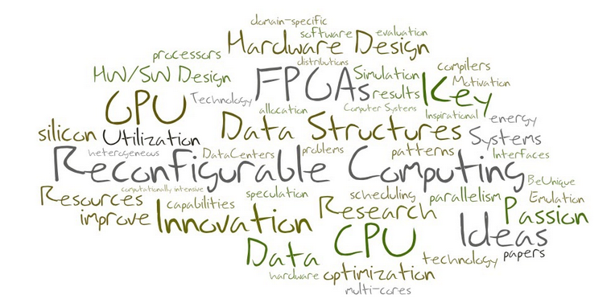

I am a Research Associate at The University of Manchester, working with Prof. Mikel Lujan. My current research centers around the interaction of specialised compute kernels with processors in modern systems and their impact on overall system performance. Specifically, I focus on designing hardware kernels for domain-specific applications, with the goal of enabling efficient co-existence with processors in heterogeneous systems. To achieve this, I develop tools and methodologies to simulate these systems from architectural and microarchitectural perspectives.

Prior to my current role, I spent nine months at Arm Research in Cambridge. My work primarily revolved around exploring parallelism at the loop level. I conducted comprehensive studies on the effects of various parallelisation strategies, constraints, and data dependencies across loops. Before that, I contributed to the <a href="https://apt.cs.manchester.ac.uk/projects/PAMELA/">PAMELA project</a>, where I focused on developing processor simulators using reconfigurable hardware (The University of Manchester).

I hold a Diploma degree in Electrical and Computer Engineering from the Technical University of Crete, which I earned in 2017. Subsequently, I pursued and successfully completed my PhD in Computer Science from The University of Manchester in 2023. Additionally, I am proud to be an Angelopoulos - Clinton GIU Fellow and a member of Angelopoulos100.

<i>I live, work and travel under the influence of music..</i>

